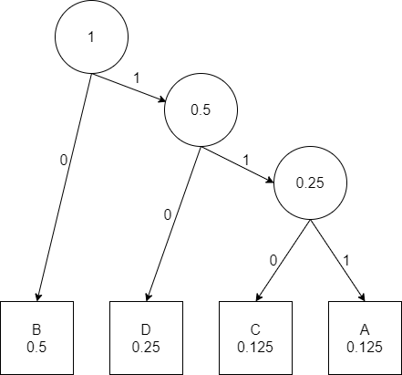

```{css, echo=FALSE}
.header-section-number::after {
  content: ".";
}
```

```{r setup, include=FALSE}
knitr::opts_chunk$set(echo = TRUE)
```

# Ejercicio 1
**Calcular la probabilidad de que si alguien es "alto", esa persona debe ser de sexo masculino.**

**Supongamos que la probabilidad de ser varón es $p(V)=0.5$ y la de ser mujer $p(M)=0.5$. Supongamos que el 20% de los hombres son altos ($A$): $P(A|V)=0.2$ y qe el 6% de las mujeres son altas: $P(A|M)=0.06$.**

## Calcular $P(V|A)$

Conocida $P(A|V)$, podemos aplicar la regla de Bayes para obtener $P(A|V)$:
$$
P(V|A) = \frac{P(A|V)P(V)}{P(A)}
$$
Para poder aplicar esta expresión solamente nos hace falta conocer el valor de $P(A)$, que lo podemos calcular utilizando el *Teorema de la probabilidad total*: $P(A)=P(A|V)P(V) + P(A|M)P(M)$.

```{r}
p_V <- 0.5
p_M <- 0.5
p_AV <- 0.2
p_AM <- 0.06

p_A <- p_AV*p_V + p_AM*p_M

p_VA <- p_AV*p_V/p_A
```

$P(V|A)=$ `r p_VA`.

## Si usted sabe que alguien es de sexo masculino, ¿qué cantidad de información obtiene (en bits) por enterarse de que también es alto?

Podríamos plantearlo de dos formas:

1. Calculamos la cantidad de información de saber que alguien es de sexo masculino y hacemos la diferencia con la cantidad de información de saber que alguien es de sexo masculino y alto.

2. Calculamos directamente la cantidad de información de saber que alguien es de sexo masculino y alto.

Elijamos lo que elijamos, la cantidad de información la podemos calcular a partir de la definición probabilística de Shannon:
$$
I_{k} = log_{2}(1/p_{k}) = -log_{2}(p_{k})
$$

```{r}
I_V <- -log(p_V, 2)
I_AV <- -log(p_AV, 2)
```


Así podemos ver que la cantidad de información por saber que alguien es de sexo masculino es: $I_{V} = -log_{2}(p_{V}) =$ `r I_V` bits.
De igual forma, la cantidad de información por saber que alguien es de sexo masculino y alto es: $I_{V|A} = -log_{2}(p_{V|A}) =$ `r I_AV` bits.
Con todo esto, podemos ver que la cantidad de información que se obtiene al enterarse de que un varón también es alto se puede calcular como $I_{A|V} - I_{V} =$ `r I_AV - I_V` bits.

## ¿Cuánta información gana al enterarse de que una mujer es alta?

En este caso repetimos el mismo procedimiento que en el apartado anterior pero para las mujeres:

```{r}
I_M <- -log(p_M, 2)
I_AM <- -log(p_AM, 2)
```

La cantidad de información por saber que alguien es de sexo femenino es: $I_{M} = -log_{2}(p_{M}) =$ `r I_M` bits.
De igual forma, la cantidad de información por saber que alguien es de sexo femenino y alta es: $I_{M|A} = -log_{2}(p_{M|A}) =$ `r I_AM` bits.
Con todo esto, podemos ver que la cantidad de información que se obtiene al enterarse de que un mujer también es alta se puede calcular como $I_{A|M} - I_{M} =$ `r I_AM - I_M` bits.

## ¿Qué cantidad de información se obtiene al enterarse de que una persona alta es una mujer?

Finalmente cambiamos las tornas y planteamos el problema contrario. Para calcular la información que se obtiene al saber que una persona alta es mujer necesitamos calcular primero la probabilidad $p(M|A)$ mediante la regla de Bayes:
$$
p(M|A) = \frac{p(A|M)p(M)}{p(A)}
$$

```{r}
p_MA <- p_AM*p_M/p_A
I_A <- -log(p_A, 2)
I_MA <- -log(p_MA, 2)
```

Vemos que la cantidad de información por saber que una persona es alta es: $I_{A} = -log_{2}(p_{A}) =$ `r I_A` bits.
De igual forma, la cantidad de información por saber que alguien alto es mujer es: $I_{M|A} = -log_{2}(p_{M|A}) =$ `r I_MA` bits.
Con todo esto, podemos ver que la cantidad de información que se obtiene al enterarse de que una persona alta es mujer se puede calcular como $I_{M|A} - I_{A} =$ `r I_MA - I_A` bits. Resulta curioso ver que parece que estemos perdiendo información, pero esto es porque como la probabilidad de ser alto es muy pequeña, saber que alguien es alto ya nos está proporcionando mucha información.

# Ejercicio 2

**La fuente de entrada a un canal de comunicación ruidoso es una variable aleatoria X sobre cuatro símbolos a, b, c, d. La salida de este canal es una variable aleatoria sobre estos mínimos cuatro símbolos. La distribución conjunta de estas dos variables aleatorias es la siguiente:**

```{r, echo=FALSE}
table_2 <- matrix(c(1/8, 1/16, 1/16, 1/4, 1/16, 1/8, 1/16, 0, 1/32, 1/32, 1/16, 0, 1/32, 1/32, 1/16, 0), nrow=4, ncol=4, byrow=TRUE)
table_2
```

## Evalúe la distribución marginal de $X$ y calcule la entropía marginal $H(X)$ en bits.

Por ahora la hipótesis que estamos barajando es que la distribución marginal de $X$ se puede calcular como la suma de las columnas, i.e. $P(X=a)$ es la suma de la columna $x=a$. Sabiendo eso, podemos calcular fácilmente la entropía según su expresión:
$$
H(X) = \sum_{k}p(x_{k})log_{2}(p(x_{k}))
$$

```{r}
p_X <- colSums(table_2)
H_X <- -sum(p_X*log(p_X, 2))
```

$H(X) =$ `r H_X` bits.


## Evalúe la distribución marginal de $Y$ y calcule la entropía marginal $H(Y)$ en bits.

Podemos repetir el mismo cálculo pero para $Y$ teniendo en cuenta que ahora la distribución marginal se calculará como la suma de las filas:

```{r}
p_Y <- rowSums(table_2)
H_Y <- -sum(p_Y*log(p_Y, 2))
```

$H(Y) =$ `r H_Y` bits.

## ¿Cuál es la entropía conjunta $H(X,Y)$ de las dos variables aleatorias en bits?

Para calcular la entropía conjunta primero tenemos que calcular la probabilidad conjunta $P(X,Y)=P(X|Y)P(Y)=P(Y|X)P(X)$:

```{r}
p_X_Y <- table_2
H_X_Y <- -sum(p_X_Y*replace(log(p_X_Y), which(table_2==0), 0))
H_X_Y
```


## ¿Cuál es la entropía condicional $H(Y|X)$ en bits?

Para calcular la entropía condicional podemos aprovechar las propiedades de la información mútua:
$$
I(X,Y) = H(X) + H(Y) - H(X,Y)
$$
$$
I(X,Y) = H(Y) - H(Y|X)
$$
Igualando las dos expresiones obtenemos:
$$
H(X) + H(Y) - H(X,Y) = H(Y) - H(Y|X) \rightarrow \boxed{H(Y|X) = H(X,Y) - H(X)}
$$
```{r}
H_YX <- H_X_Y - H_X
H_YX
```

## ¿Cuál es la información mútua $I(X,Y)$ entre las dos variables aleatorias en bits?

La información mutua la podemos calcular, por ejemplo, utilizando la primera de las expresiones que hemos puesto en el apartado anterior.

```{r}
I_X_Y <- H_X + H_Y - H_X_Y
I_X_Y
```

## Proporcionar una estimación del límite inferior de la capacidad del canal C para este canal de bits.

Cualquier estimación de $I(X,Y)$ nos daría una cota inferior de la capacidad del canal, por lo que la cota inferior serían `r I_X_Y` bits.

# Ejercicio 4

## ¿Cuál es la entropía H, en bits, del siguiente alfabeto fuente cuyas letras tienen las siguientes probabilidades?

```{r}
probs <- c(1/8, 1/2, 1/8, 1/4)
names(probs) <- c("A", "B", "C", "D")
probs
```

```{r}
H <- -sum(probs*log(probs,2))
H
```

## ¿Por qué los códigos de longitud fija son ineficientes para alfabetos cuyas letras no son equiprobables? Discutir esto en relación con el código Morse.

A la hora de buscar una codificación eficiente, tiene mucho más sentido asignar menos símbolos a las letras que aparecen con mayor frecuencia para reducir al máximo la longitud de los mensajes codificados. Esto nos permite transmitir la misma información que si tuviésemos una longitud fija pero con menos bits, que siempre es algo bueno. En relación al código Morse se puede ver que, por ejemplo, la E y la A son las dos letras más frecuentes del diccionario de Oxford, y sus símbolos en Morse son "." y ".-" respectivamente. Por otro lado, la J o la Q son de las letras menos frecuentes y sus símbolos son ".---" y "--.-" respectivamente. De esta forma se puede conseguir una transmisión mucho más eficiente.

## Presente un ejemplo de un código de prefijo unívocamente descifrable para el alfabeto anterior que sea óptimamente eficiente. ¿Qué características lo convierten en un código de prefijo unívocamente descifrable?

Un código es unívocamente descifrable si su extensión es no singular, es decir, no hay ambigüedades para descifrar una secuencia codificada.

Un código prefijo es un código unívocamente descifrable que cumple que ninguna palabra de código es prefijo de cualquier otra palabra de código del conjunto. Se suele crear con el algoritmo de Huffman. Aplicando este algoritmo podemos obtener un diagrama en árbol como el de la figura con el que podemos codificar nuestro alfabeto:



Siguiendo este diagrama obtendríamos la siguiente codificación:

* A: 111
* B: 0
* C: 110
* D: 10

Observamos que no hay ninguna ambigüedad a la hora de descifrar el código ya que ninguna palabra del código es prefijo de cualquier otra palabra del conjunto. Además, las letras más frecuentes tienen menos caracteres, por lo que también es más eficiente que una codificación de longitud fija.

## ¿Cuál es la tasa de codificación, R, de su código? ¿Cómo sabe si es óptimamente eficiente?

La tasa de codificación R se puede obtener como $R = \sum_{k} p(x_{k})L(x_{k})$ y tiene que ser mayor o igual al la entropía, $H(x)$ para que no haya distorsión. Podemos calcularlo si creamos un vector con las codificaciones y utilizamos la función `nchar()` para obtener las longitudes de las secuencias:

```{r}
L <- c("111", "0", "110", "10")
R <- sum(probs*nchar(L))
R
```

Obtenemos $R=H(x)$. Esto quiere decir que, según el *Tma Source Coding*, tenemos una codificación óptimamente eficiente.

## ¿Cuál es la entropía máxima posible, H, de un alfabeto que está compuesto por N letras diferentes? En tal alfabeto de máxima entropía, ¿cuál es la probabilidad de su letra más probable? ¿Cuál es la probabilidad de su letra menos probable?

La entropía se maximiza cuando todas las letras son equiprobables, por lo que la probabilidad de la letra más probable es $1/N$ y la de la letra menos probable también es $1/N$. En este caso podemos ver de forma analítica que la entropía sería $H(x)=\mathrm{log}_{2}(N)$:
$$
H(x) = -\sum_{k}p(x_{k})\mathrm{log}_{2}(p(x_{k})) = -N(\frac{1}{N})\mathrm{log}_{2}(\frac{1}{N}) = \mathrm{log}_{2}(N)
$$